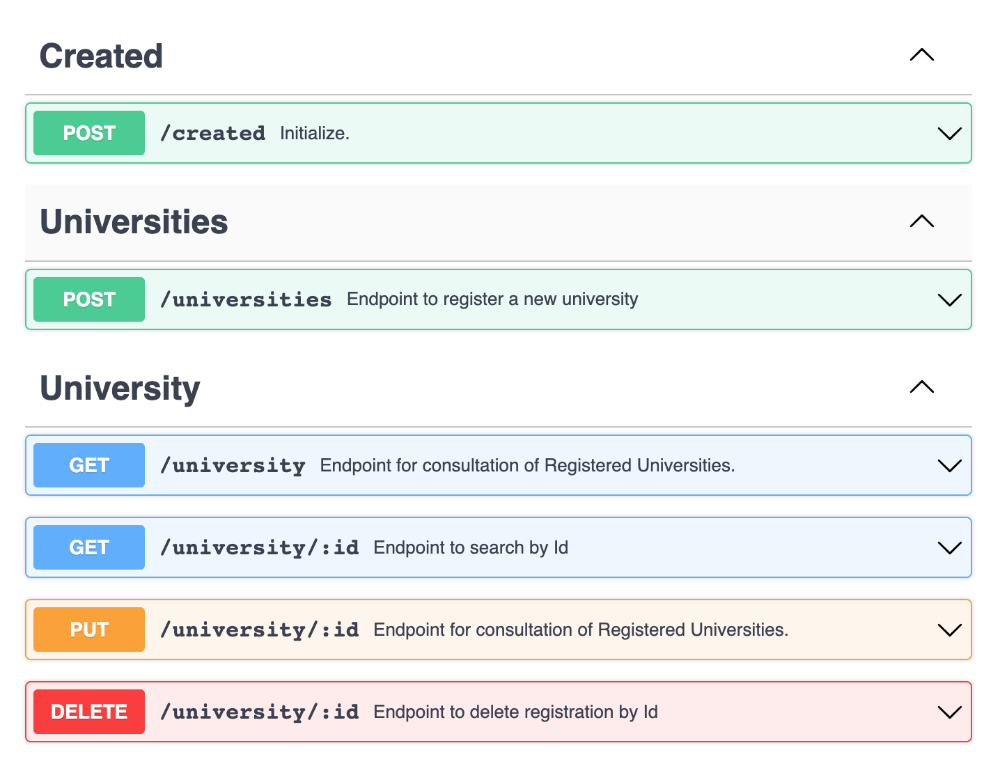

# DS Vendas
 

# Sobre o projeto

Exercício proposto pela IBM baseado em um dos testes aplicados pelo Sicredi envolvendo uma aplicação backend em Springboot.

##

## Métodos Http

# Tecnologias utilizadas
## Back end
- Node
- TypeScript
- Express
- Mongo DB
- Yarn
- Postman

# Como executar o projeto

## Back end
Pré-requisitos: 
- Node
- Yarn
- Mongo DB

## Antes de Executar
Preencher o arquivo .env:
- MONGO_URI
- MONGODB_USER
- MONGODB_ADM_PASS

## Executar
No terminal executar os seguintes comandos:
- yarn install
- yarn dev

## Testes
Confira a collection do Postman:
- Bis2Bis.postman_collection.json

# Autor
Edmilson Emmanuel Moura Andrade

https://www.linkedin.com/in/edmilson-emmanuel-moura-andrade/
